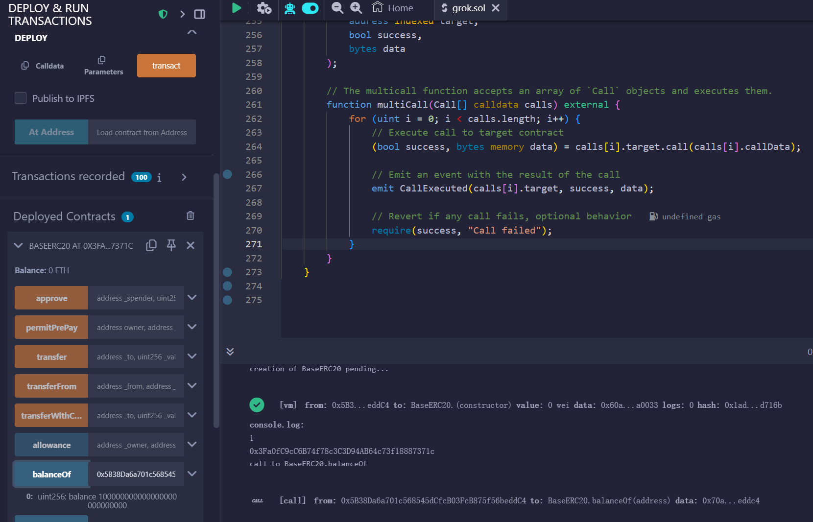
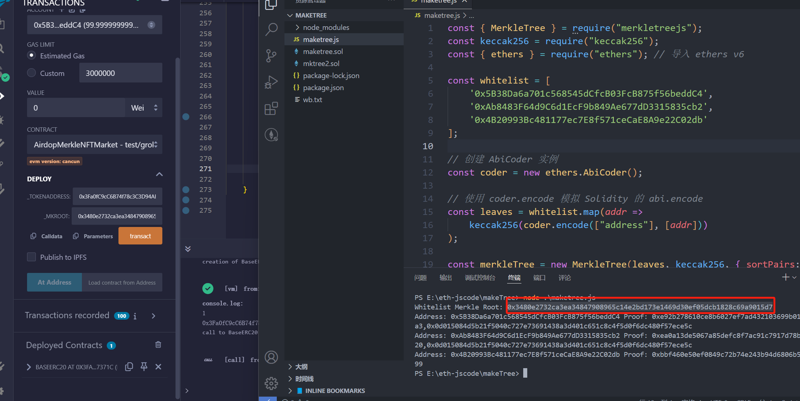
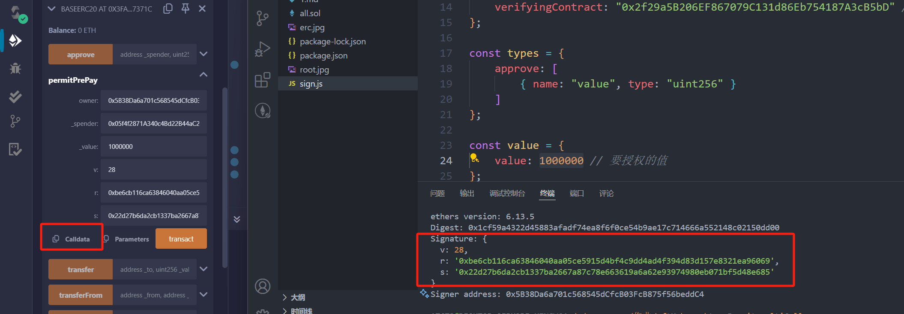
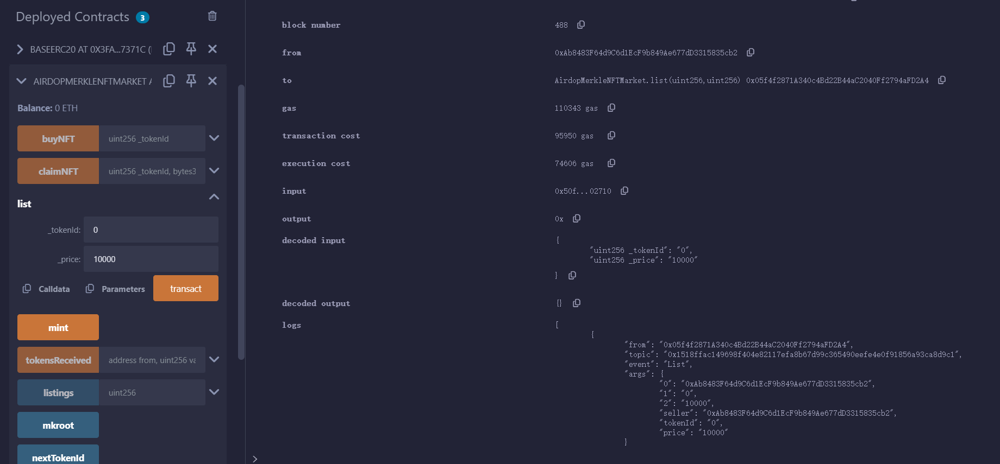
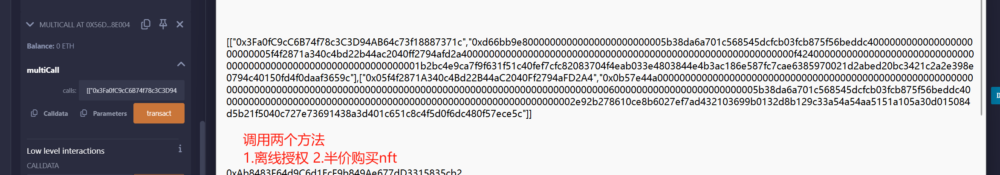
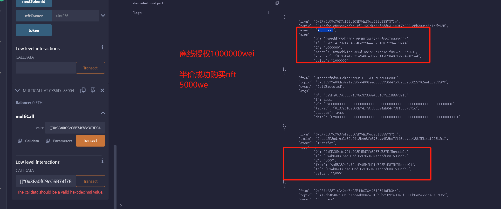
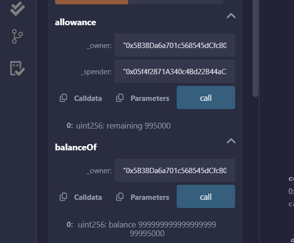

# 离线授权 multicall MakeTree 知识点

---
## 1. 流程

### 1.1 部署 erc20合约 把代币全部分配给 0x5B38Da6a701c568545dCfcB03FcB875f56beddC4地址

### 1.2 部署 nftmaker合约 部署 multiCall 合约

- token地址指向erc20合同 -> 0x3Fa0fC9cC6B74f78c3C3D94AB64c73f18887371c
- 用js代码生成 默克尔树

###  1.3 使用js代码线下签名 token的离线签名方法

- 签名需要授权的数量 把授权的地址指向nftmaker 保存calldata 

- 0xd66bb9e80000000000000000000000005b38da6a701c568545dcfcb03fcb875f56beddc400000000000000000000000005f4f2871a340c4bd22b44ac2040ff2794afd2a400000000000000000000000000000000000000000000000000000000000f4240000000000000000000000000000000000000000000000000000000000000001cbe6cb116ca63846040aa05ce5915d4bf4c9dd4ad4f394d83d157e8321ea9606922d27b6da2cb1337ba2667a87c78e663619a6a62e93974980eb071bf5d48e685

###  1.4 账户2去mint NFT编号Token0 并且上架价格为 10000w

###  1.5 构建白名单半价 购买的 calldata

-  0x0b57e44a000000000000000000000000000000000000000000000000000000000000000000000000000000000000000000000000000000000000000000000000000000600000000000000000000000005b38da6a701c568545dcfcb03fcb875f56beddc40000000000000000000000000000000000000000000000000000000000000002e92b278610ce8b6027ef7ad432103699b0132d8b129c33a54a54aa5151a105a30d015084d5b21f5040c727e73691438a3d401c651c8c4f5d0f6dc480f57ece5c

###  1.6 一笔交易调用 多个方法

###  1.7 成功购买

###  1.8 购买成功后 币转账以及授权额度减少
